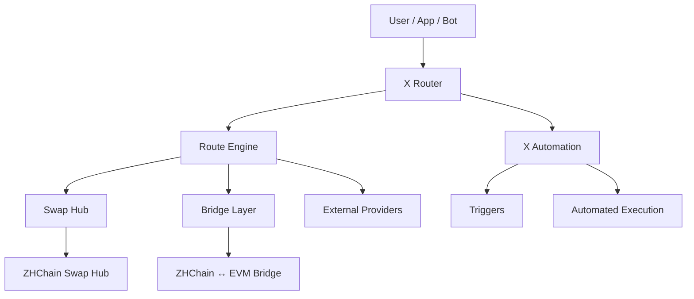

# Alexey Chistyakov

### Cross-chain infrastructure · Routing · Automation · Web3 tooling

Independent builder working on infrastructure for cross-chain execution, routing, automation and blockchain interoperability.

I build modular systems that connect swaps, bridges and execution providers without locking the architecture to a single network, liquidity source or backend.

---

## 🚀 Current Focus

- **[X Router](https://github.com/lesha73/x-router)** — cross-chain route discovery and execution layer
- **X Automation** — condition-based blockchain automation
- **[ZHChain Swap Hub](https://github.com/lesha73/zhchain-swap-hub)** — on-chain swap and liquidity infrastructure
- **[ZHChain ↔ EVM Bridge](https://github.com/lesha73/zhchain-evm-bridge)** — cross-chain bridge infrastructure
- **[QLAQSON](https://github.com/qlaqson/qlaqson)** — blockchain-native messaging, identity and secure communication platform

---

## 🛠 What I'm Building

I'm working on infrastructure that connects swaps, bridges and execution providers through a unified routing and automation layer.

The goal is to make cross-chain execution easier to discover, compare and automate while keeping each underlying provider independent.

This allows the architecture to evolve without hard-coding the system to a single blockchain, liquidity source or execution environment.

---

## 🧭 X Router Architecture

Unified route discovery, execution and automation across swaps, bridges and external providers.

---

## 🔗 Projects

### [X Router](https://github.com/lesha73/x-router)

Cross-chain routing and automation layer for swaps, bridges and execution providers.

### [ZHChain Swap Hub](https://github.com/lesha73/zhchain-swap-hub)

On-chain swap and liquidity infrastructure for ZHChain with quote, preflight and transaction preparation flows.

### [ZHChain ↔ EVM Bridge](https://github.com/lesha73/zhchain-evm-bridge)

Cross-chain bridge infrastructure connecting ZHChain with EVM-compatible networks.

### [QLAQSON](https://github.com/qlaqson/qlaqson)

Blockchain-native messaging, identity and secure communication platform.

Website: [qlaqson.com](https://qlaqson.com/)

---

## ⚙️ Tech Stack

`JavaScript` · `Node.js` · `Solidity` · `EVM` · `JSON-RPC`  
`Cloudflare Workers` · `D1` · `REST APIs` · `PowerShell`

---

## 🌍 Areas of Interest

Cross-chain routing · Blockchain automation · Interoperability  
Developer tooling · Web3 infrastructure · Smart contract systems

---

## 🤝 Open To

Grants · Accelerators · Technical collaborations · Infrastructure partnerships
