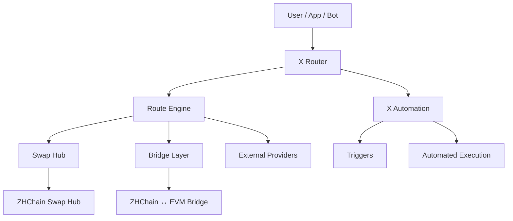

# Alexey Chistyakov

**Cross-chain infrastructure · Routing · Automation · Web3 tooling**

Independent builder focused on blockchain infrastructure, cross-chain execution, automation and developer tooling.

---

## 🚀 Current Focus

- **X Router** — cross-chain route discovery and execution layer
- **X Automation** — condition-based blockchain automation
- **ZHChain Swap Hub** — on-chain swap and liquidity infrastructure
- **ZHChain ↔ EVM Bridge** — cross-chain bridge infrastructure
- **QLAQSON** — blockchain messenger and identity-oriented Web3 communication

---

## 🛠 What I'm Building

I'm working on infrastructure that connects swaps, bridges and execution providers through a unified routing and automation layer.

The goal is to make cross-chain execution easier to discover, compare and automate without locking the system to a single liquidity source or blockchain.

---

## 🧭 X Router Architecture

Unified route discovery, execution and automation across swaps, bridges and external providers.

---

## ⚙️ Tech Stack

`JavaScript` · `Node.js` · `Solidity` · `EVM` · `JSON-RPC`  
`Cloudflare Workers` · `D1` · `REST APIs` · `PowerShell`

---

## 🌍 Areas of Interest

Cross-chain routing · Blockchain automation · Interoperability  
Developer tooling · Web3 infrastructure · Smart contract systems

---

## 🤝 Open To

Grants · Accelerators · Technical collaborations · Infrastructure partnerships
